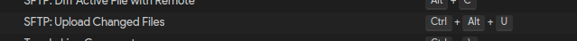

- [vscode-sftp Frequently Asked Questions](#vscode-sftp-frequently-asked-questions)
  - [Error: Failure](#error-failure)
    - [Error: Failure - Solution One](#error-failure---solution-one)
    - [Error: Failure - Solution Two](#error-failure---solution-two)
  - [ENFILE: file table overflow](#enfile-file-table-overflow)
  - [How do I upload content inside a folder, but not the folder itself?](#how-do-i-upload-content-inside-a-folder-but-not-the-folder-itself)
  - [Clicking Upload Changed Files does not work](#clicking-upload-changed-files-does-not-work)
  - [How can I upload files as root?](#how-can-i-upload-files-as-root)

## Error: Failure

The failure error message comes from the remote side and is more or less the default/generic error 
message that SSH' sftp server sends when a syscall fails or something similar happens.
To know what exactly is going wrong you could try to enable debug output for the sftp server, 
and then execute your transfers again and see what (if anything) shows up in the logs there.

### Error: Failure - Solution One

Change `remotePath` to the actual path if it's a symlink.

### Error: Failure - Solution Two

The problem would be that your server runs out of file descriptors.
You should try to increase the file descriptors limit.
If you don't have the permission to do this, set [limitOpenFilesOnRemote](https://github.com/Natizyskunk/vscode-sftp/wiki/Config#limitopenfilesonremote) option in your config.

## ENFILE: file table overflow ...

MacOS have a harsh limit on number of open files.

### ENFILE: file table overflow ... - Solution for MacOS harsh limit

Run those command:
```sh
echo kern.maxfiles=65536 | sudo tee -a /etc/sysctl.conf
echo kern.maxfilesperproc=65536 | sudo tee -a /etc/sysctl.conf
sudo sysctl -w kern.maxfiles=65536
sudo sysctl -w kern.maxfilesperproc=65536
ulimit -n 65536
```

## How do I upload content inside a folder, but not the folder itself?

See [vscode-sftp issue #852](https://github.com/liximomo/vscode-sftp/issues/852).

As quoted from **raoul2000**, "as long as you set the `context` property to `./[path]` (e.g., `./build`), it
will work."

Example config (where all JS and HTML files in `./build` will be copied to `/folder1/folder2/folder3`):
```json
{
    "name": "My Server",
    "host": "10.19.5.33",
    "protocol": "sftp",
    "port": 22,
    "username": "user1",
    "remotePath": "/folder1/folder2/folder3",
    "context": "./build",
    "uploadOnSave": false,
    "watcher": {
        "files": "*.{js,html}",
        "autoUpload": true,
        "autoDelete": false
    }
}
```

## Clicking Upload Changed Files does not work

See [vscode-sftp issue #854](https://github.com/liximomo/vscode-sftp/issues/854).

**danieleiobbi** has a workaround to create a keyboard shortcut.



## How can I upload files as root?

See [vscode-sftp issue #559](https://github.com/liximomo/vscode-sftp/issues/559).

**Yevhen-development** has a workaround, but it may not work for everyone.  In `sftp.json`, set the
following:
```json
"sshCustomParams": "sudo su -;"
```
